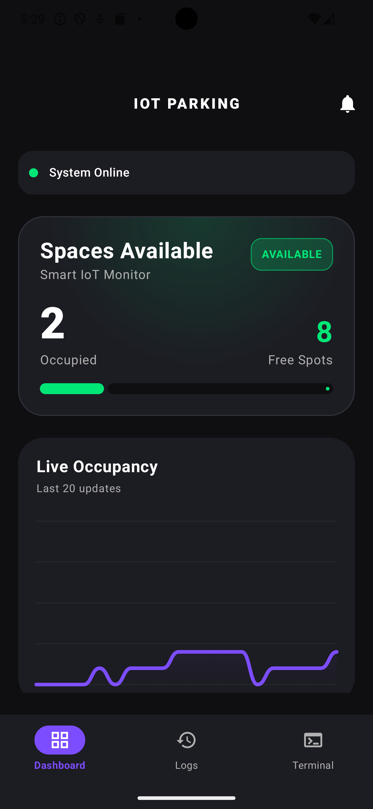
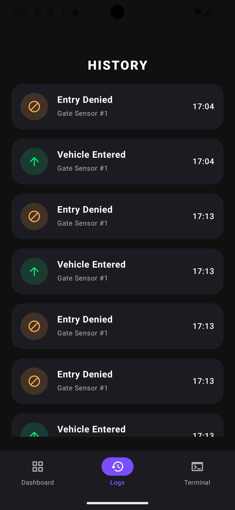
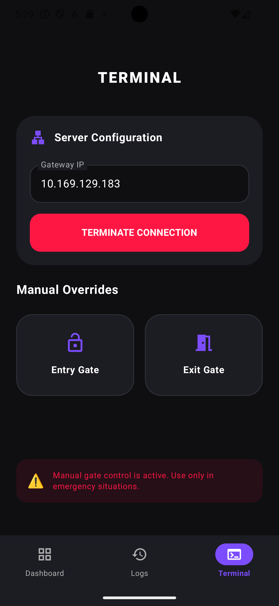
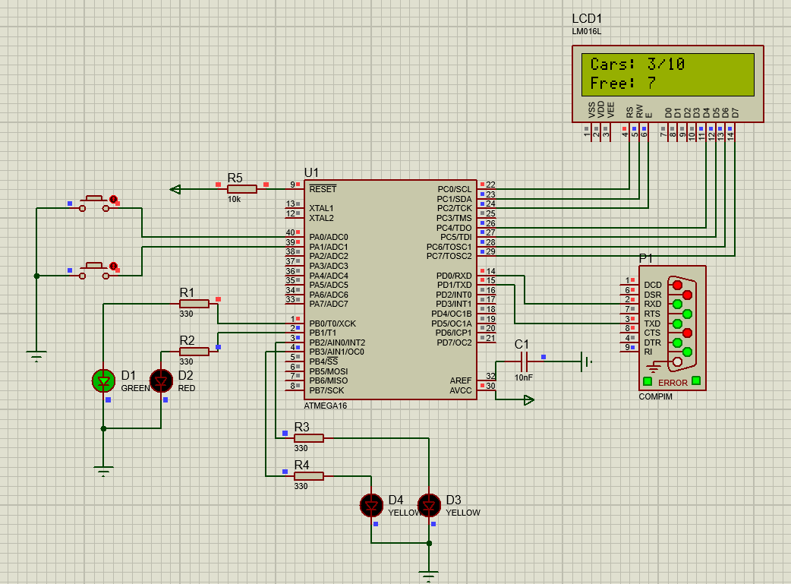
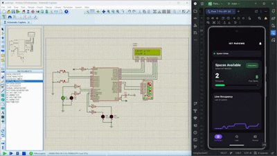

# 🚗 Smart Parking IoT Platform

**An IoT-based smart parking management system with real-time Android monitoring and remote gate control.** 📡📱

Smart Parking IoT Platform is an end-to-end embedded systems project that demonstrates the integration of a microcontroller-based parking management system with a modern Android application.

The system simulates a parking facility in Proteus, monitors vehicle entry and exit events through sensors, and transmits parking data to an Android dashboard using a Python communication bridge.

The Android application provides real-time parking statistics, event history tracking, and remote gate control capabilities.

---

# 🏗️ Architecture & Tech Stack

### Embedded System

* Microcontroller: ATmega16
* Firmware Language: C (CodeVision AVR)
* Simulation Environment: Proteus
* LCD 16x2 Display
* Entry / Exit Sensors
* Parking Gate Control
* UART Serial Communication

### Communication Layer

* Python Bridge Server
* TCP Socket Communication
* JSON Data Exchange
* Virtual COM Ports (com0com / VPSE)

### Android Application

* Kotlin
* Jetpack Compose
* MVVM Architecture
* Material Design 3
* Real-Time Dashboard
* Socket-Based Communication

---

# 🔗 System Architecture

The project consists of four main layers:

1. Embedded Parking Controller
2. Serial Communication Layer
3. Python Bridge Server
4. Android Dashboard

### Data Flow

Vehicle Entry/Exit
↓
ATmega16 Firmware
↓
UART Serial Communication
↓
Python Bridge Server
↓
TCP Socket Server
↓
Android Application

The Android application receives live parking information and visualizes system status in real time.

---

# 🔄 Bidirectional Communication

The system supports two-way communication.

### Parking Controller → Android

The microcontroller continuously sends:

* Current vehicle count
* Parking capacity
* Available parking spaces
* Parking status
* Event notifications

Example:

```json
{
  "cars": 4,
  "capacity": 10,
  "available": 6,
  "status": "available",
  "event": "enter"
}
```

### Android → Parking Controller

The Android application can remotely send commands:

```json
{
  "cmd": "open_gate_in"
}
```

```json
{
  "cmd": "open_gate_out"
}
```

These commands allow remote operation of parking gates directly from the mobile dashboard.

---

# 📱 Android Application Features

### Dashboard

* Real-time vehicle count
* Parking occupancy monitoring
* Available space calculation
* System status visualization

### Event Monitoring

* Vehicle entry detection
* Vehicle exit detection
* Parking full alerts
* Remote gate operation logs

### Remote Control

* Open Entry Gate
* Open Exit Gate
* Live communication with microcontroller

### History Tracking

* Recent parking events
* Timestamped activity records
* Real-time updates without manual refresh

---

# 📊 Parking Status Management

The system automatically calculates:

* Total Parking Capacity
* Current Vehicle Count
* Available Parking Spaces

Status Modes:

* Available
* Full

When capacity is reached, new vehicles are denied entry and a corresponding event is generated.

---

# 🖥️ Embedded Features

* LCD status display
* Vehicle counting logic
* Entry and exit management
* Gate automation
* Parking capacity control
* UART communication
* Event generation and reporting

---

# 📂 Project Structure

SmartParking-IoT
├── android-app
│   └── Android Application (Kotlin + Jetpack Compose)
├── python-bridge
│   └── TCP & Serial Communication Server
├── proteus
│   └── Proteus Simulation Files
├── codevision
│   └── ATmega16 Firmware Source Code
├── docs
│   └── Screenshots & Documentation
└── README.md

---

# ⚙️ How It Works

1. Run the Proteus simulation.
2. Start the Python bridge server.
3. Launch the Android application.
4. The microcontroller sends parking data via UART.
5. The Python bridge converts serial data into TCP messages.
6. The Android dashboard receives updates in real time.
7. Users can remotely control parking gates from the application.

---

# 🎯 Educational Objectives

This project demonstrates:

* Embedded Systems Programming
* AVR Microcontroller Development
* Serial Communication (UART)
* IoT Communication Architecture
* Socket Programming
* Android Application Development
* MVVM Architecture
* Real-Time Data Synchronization

---

# 📋 Feature Overview

| Feature                        | Description                                            |
| ------------------------------ | ------------------------------------------------------ |
| 🚗 Vehicle Counting            | Automatically tracks vehicle entry and exit            |
| 📊 Live Dashboard              | Displays real-time parking statistics                  |
| 🅿️ Capacity Monitoring        | Shows total capacity and available spaces              |
| 📡 Real-Time Communication     | Instant synchronization between MCU and Android        |
| 📜 Event History               | Stores and displays recent parking events              |
| 🚪 Remote Gate Control         | Open entry and exit gates from the mobile app          |
| 🔄 Bidirectional Communication | Android and microcontroller exchange commands and data |
| 🖥️ LCD Monitoring             | Parking information displayed on 16x2 LCD              |
| 🔴 Full Parking Detection      | Detects when parking reaches maximum capacity          |
| 🐍 Python Bridge               | Connects UART communication with Android sockets       |

---

## 📱 Application Screenshots

<table align="center">
  <tr>
    <th>Dashboard</th>
    <th>Event History</th>
    <th>Remote Control</th>
  </tr>
  <tr>
    <td>
      
    </td>
    <td>
      
    </td>
    <td>
      
    </td>
  </tr>
</table>

---

# 🖥️ Proteus Simulation

<p align="center">
  
</p>

<p align="center">
  Embedded system simulation including sensors, LCD, gates, and ATmega16 firmware.
</p>

---

# 🎥 Application Demo

<p align="center">
  
</p>

---

# ⚠️ Project Status

This project was developed as an educational IoT and embedded systems demonstration project.

Current Version:

* Embedded Simulation ✅
* Python Communication Bridge ✅
* Android Dashboard ✅
* Remote Gate Control ✅
* Real-Time Monitoring ✅

---

# 👨‍💻 Author

Yasin Moridi

Android Developer & Embedded Systems Enthusiast

---

# 📄 License

Released under the MIT License.
